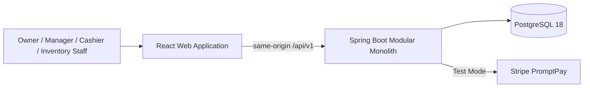
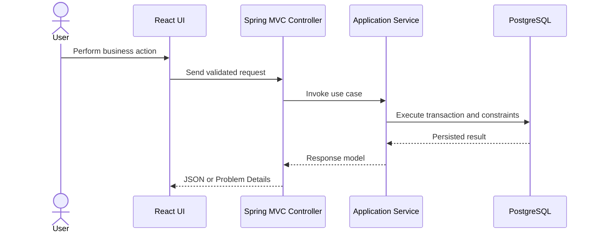

# Architecture Overview

## System context

Retail POS & Inventory is a single-store web application. React provides the cashier and back-office interface, while Spring Boot owns authentication, authorization, business rules, transactions, reporting, and integrations.



## Backend modules

```text
com.got.retailpos
├── identity
├── catalog
├── inventory
├── customers
├── sales
├── payments
├── reporting
└── shared
```

Each module owns its domain objects, application services, persistence adapters, and web endpoints. A module must not use another module's repository directly. Cross-module operations go through application interfaces or explicit domain events.

## Request flow



Controllers remain thin. Business invariants belong in domain/application services, and the database provides the final concurrency and integrity boundary.

## Production artifact

The Docker build compiles React first, copies the static output into Spring Boot resources, packages one executable JAR, and runs it as a non-root user on a Java 21 JRE. This keeps browser requests same-origin and avoids maintaining separate frontend and backend deployments for the first release.
