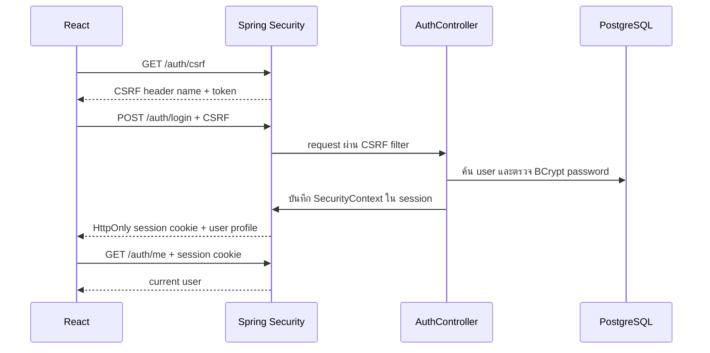

# บทเรียน 02: Session Authentication และ RBAC

## คืออะไร

Authentication ตอบว่า “ผู้ใช้คือใคร” ส่วน Authorization ตอบว่า “ผู้ใช้นั้นทำอะไรได้บ้าง” ระบบนี้มีสี่บทบาทคือ OWNER, MANAGER, CASHIER และ INVENTORY_STAFF

RBAC หรือ Role-Based Access Control คือการรวมสิทธิ์ไว้ตามหน้าที่งาน แทนการกำหนดสิทธิ์รายคน ช่วยให้ร้านเพิ่มพนักงานและเปลี่ยนหน้าที่ได้โดยไม่ต้องแก้กฎทุก endpoint

## Request ทำงานอย่างไร

`SecurityConfig` เป็นด่านหน้า ตรวจ session, CSRF และ URL policy ก่อน request ถึง controller ส่วน `@PreAuthorize` ตรวจ role ที่ method อีกครั้ง กฎสร้างผู้ใช้อยู่ใน `UserAccountService` ซึ่งเปิด transaction ครอบการตรวจ username และการบันทึกข้อมูล

## ทำไมใช้ Session แทน JWT

- React และ Spring Boot ถูก deploy เป็น same-origin เดียวกัน
- Browser เก็บ session identifier ใน HttpOnly cookie จึงอ่านจาก JavaScript ไม่ได้
- Logout และการเปลี่ยน session id หลัง login มี implementation ที่ Spring Security ดูแลให้
- Phase 1 ไม่มี mobile client หรือ third-party API ที่ต้องพก bearer token

JWT ไม่ได้ทำให้ระบบปลอดภัยขึ้นโดยอัตโนมัติ หากเก็บ token ใน localStorage ความเสียหายจาก XSS จะสูงขึ้น และยังต้องออกแบบ revoke/refresh เพิ่ม

## Session cookie กับ CSRF token ต่างกันอย่างไร

- Session cookie ยืนยันตัวผู้ใช้ Browser แนบให้อัตโนมัติและตั้งเป็น HttpOnly
- CSRF token พิสูจน์ว่า request ที่เปลี่ยนข้อมูลมาจากหน้าเว็บของเรา React ต้องอ่าน token และส่งใน header เอง

เพราะ browser แนบ cookie อัตโนมัติ การมี session อย่างเดียวจึงยังเสี่ยง CSRF ระบบบังคับ token กับ POST, PUT, PATCH และ DELETE รวมถึง login และ logout

## จุดที่ควรระวัง

- Production HTTPS ต้องตั้ง `SESSION_COOKIE_SECURE=true`
- ห้าม log raw password, session id หรือ CSRF token
- หลัง login/logout ต้องขอ CSRF token ใหม่เพราะ Spring Security rotate token
- `@PreAuthorize` ต้องมี security test ครบทุก role ที่อนุญาตและปฏิเสธ
- บัญชี OWNER ครั้งแรกมาจาก environment variable และฐานข้อมูลเก็บเฉพาะ BCrypt hash

## ลองอธิบายกลับ

1. เพราะเหตุใด HttpOnly session cookie ยังต้องใช้ CSRF token?
2. `SecurityFilterChain` กับ `@PreAuthorize` ป้องกันคนละชั้นอย่างไร?
3. ถ้าเพิ่ม mobile app ในอนาคต เราควรทบทวนการตัดสินใจข้อใด?
