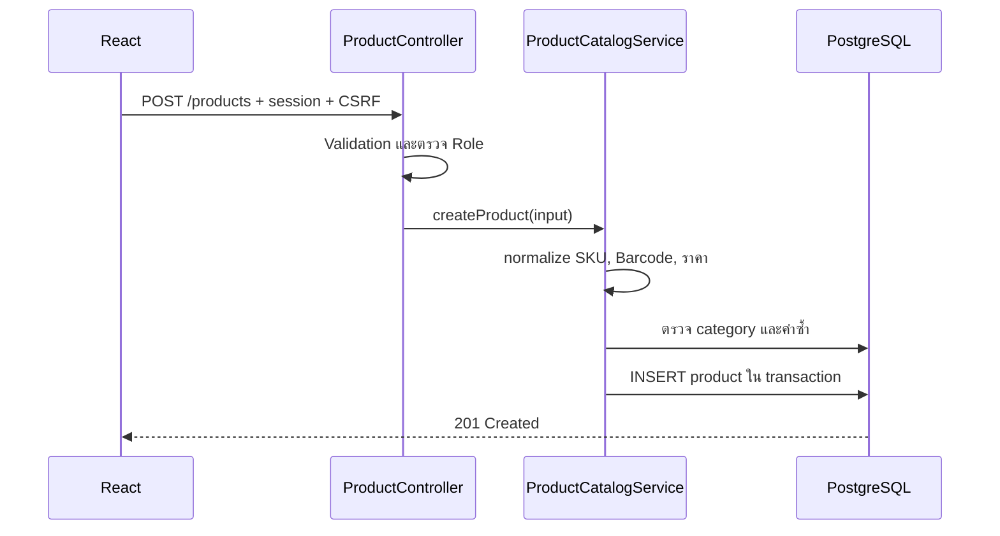
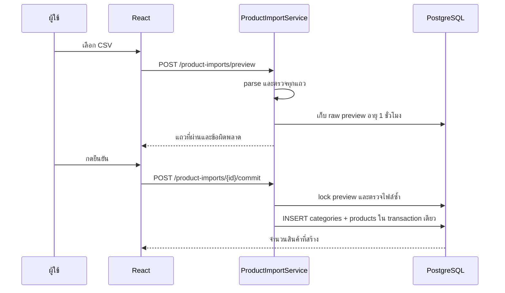

# บทเรียน 03: Catalog และ CSV Preview

## คืออะไร

Catalog คือข้อมูลหลักของสินค้า เช่น หมวดหมู่, SKU, Barcode, ชื่อ, ราคาขาย และจุดเตือนสต็อกต่ำ ข้อมูลนี้ถูกใช้ต่อโดยการรับสินค้า, Stock Ledger, POS และรายงาน จึงต้องตรวจความถูกต้องก่อนเริ่มมีธุรกรรม

SKU เป็นรหัสภายในร้านและต้องไม่ซ้ำ ส่วน Barcode เป็นรหัสสำหรับสแกนและไม่บังคับ แต่หากระบุต้องไม่ซ้ำเช่นกัน ระบบแปลง SKU เป็นตัวพิมพ์ใหญ่ก่อนบันทึกเพื่อลดข้อมูลซ้ำอย่าง `hammer-01` กับ `HAMMER-01`

## Request ทำงานอย่างไร

### เพิ่มสินค้าหนึ่งรายการ



Controller ตรวจรูปแบบ request ส่วน `ProductCatalogService` ถือ business rules และ transaction boundary ฐานข้อมูลมี unique constraint เป็นด่านสุดท้าย เผื่อมีสอง request เข้ามาพร้อมกันระหว่างการตรวจค่าซ้ำ

### นำเข้าหลายรายการ



## ทำไม Preview ยังไม่สร้างสินค้า

ไฟล์ CSV ผิดหนึ่งคอลัมน์อาจสร้างข้อมูลเสียหลายร้อยรายการ ถ้า preview เขียนข้อมูลทันที ผู้ใช้ต้องตามลบและอาจมีธุรกรรมอ้างถึงสินค้าเหล่านั้นแล้ว ระบบจึงแยกเป็นสองคำสั่ง:

1. `preview` อ่านและแสดงผลโดยไม่สร้างสินค้า
2. `commit` ตรวจข้อมูลกับฐานข้อมูลปัจจุบันอีกครั้ง แล้วบันทึกทั้งชุด

การตรวจซ้ำตอน commit สำคัญ เพราะระหว่างที่ผู้ใช้ดู preview คนอื่นอาจสร้าง SKU หรือ Barcode เดียวกันไปแล้ว

## Atomic import และ Pessimistic Lock

Atomic หมายถึงสำเร็จทั้งหมดหรือไม่บันทึกเลย การสร้างหมวดหมู่และสินค้าทั้งไฟล์อยู่ใน transaction เดียว หากแถวท้ายชน unique constraint PostgreSQL จะ rollback แถวก่อนหน้าด้วย

Pessimistic lock ล็อกแถว `product_imports` ระหว่าง commit เพื่อไม่ให้ผู้ใช้กดยืนยัน preview เดียวกันพร้อมกันสอง request วิธีนี้เหมาะกับ operation ที่เกิดไม่บ่อยแต่ผลของการทำซ้ำมีต้นทุนสูง

## CSV contract

ไฟล์ต้องเป็น UTF-8 ขนาดไม่เกิน 2 MB และไม่เกิน 1,000 แถว พร้อม header:

```csv
sku,barcode,name,category,salePrice,lowStockThreshold
HAMMER-01,885000000001,ค้อนหงอน,เครื่องมือ,250.00,3
SCREW-001,,สกรู 1 นิ้ว,ฮาร์ดแวร์,2.50,100
```

## จุดที่ควรระวัง

- Preview หมดอายุภายในหนึ่งชั่วโมงและยืนยันได้โดยผู้สร้างเท่านั้น
- ห้ามเชื่อการตรวจจาก frontend เพราะ request สามารถเรียก API โดยตรงได้
- เงินใช้ `BigDecimal` และราคาขายมีทศนิยมไม่เกินสองตำแหน่ง
- ข้อจำกัด 1,000 แถวช่วยควบคุม memory และระยะเวลาที่ transaction ถือ lock
- เมื่อข้อมูล Catalog ถูกอ้างใน sale แล้ว การแก้ชื่อหรือราคาต้องไม่เปลี่ยน snapshot ในบิลเก่า

## ลองอธิบายกลับ

1. เพราะเหตุใด commit ต้องตรวจ SKU ซ้ำ แม้ preview ผ่านแล้ว?
2. Transaction เดียวช่วยอย่างไรเมื่อแถวสุดท้ายของไฟล์ผิด?
3. Application check กับ database unique constraint ป้องกันปัญหาต่างกันอย่างไร?
