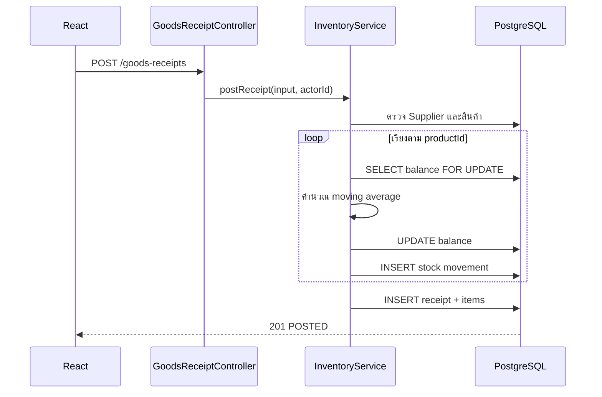

# บทเรียน 04: Stock Ledger, Row Lock และต้นทุนถัวเฉลี่ย

## คืออะไร

`inventory_balances` คือยอดปัจจุบันที่อ่านเร็ว ส่วน `stock_movements` คือประวัติทุกเหตุการณ์ที่ทำให้ยอดเปลี่ยน ระบบต้องมีทั้งสองอย่าง เพราะมีเฉพาะยอดปัจจุบันจะตอบไม่ได้ว่า “ยอดนี้มาจากไหน” แต่คำนวณยอดใหม่จากประวัติทั้งหมดทุกครั้งก็ช้าและ lock ยาก

- `onHand`: สินค้าที่ร้านถืออยู่จริง
- `reserved`: สินค้าที่จองให้การชำระเงินที่ยังไม่จบ
- `available`: จำนวนที่ขายเพิ่มได้ คำนวณจาก `onHand - reserved`

## Goods Receipt ทำงานอย่างไร



`@Transactional` ครอบทุกขั้น หากสินค้ารายการสุดท้ายผิด receipt, items, balances และ movements ทั้งหมดจะ rollback

## ต้นทุนถัวเฉลี่ยเคลื่อนที่

สูตรคือ:

```text
ต้นทุนเฉลี่ยใหม่ =
((จำนวนเดิม × ต้นทุนเฉลี่ยเดิม) + (จำนวนรับ × ต้นทุนรับ))
÷ (จำนวนเดิม + จำนวนรับ)
```

ตัวอย่าง มี 10 ชิ้น ต้นทุนเฉลี่ย 100 บาท รับเพิ่ม 10 ชิ้น ต้นทุน 120 บาท:

```text
((10 × 100) + (10 × 120)) ÷ 20 = 110.0000 บาท
```

ระบบใช้ `BigDecimal`, เก็บต้นทุน 4 ตำแหน่ง และปัด `HALF_UP` เพื่อไม่ให้ความคลาดเคลื่อนสะสมเร็วเหมือน `double`

## Pessimistic Row Lock คืออะไร

`SELECT ... FOR UPDATE` ล็อก balance ของสินค้านั้นจน transaction จบ Request อื่นที่ต้องเปลี่ยนสินค้าเดียวกันต้องรอ แล้วอ่านยอดล่าสุดก่อนคำนวณ วิธีนี้ทำให้การรับและขายไม่เขียนทับกัน

เมื่อ receipt มีหลายสินค้า ระบบเรียง product ID ก่อนขอ lock เพื่อให้ทุก transaction จับ lock ในลำดับเดียวกัน ลดกรณี A รอ B ขณะที่ B รอ A หรือ deadlock

## ทำไม Ledger ห้ามแก้ย้อนหลัง

ถ้าแก้ movement เก่า ยอดหลังรายการถัดไป, ต้นทุน และเอกสารอ้างอิงจะไม่สอดคล้องกัน ระบบจึงใช้ PostgreSQL trigger ปฏิเสธ `UPDATE` และ `DELETE` แม้เรียก SQL ตรง การแก้ยอดต้องสร้าง adjustment ใหม่ที่มีผู้กระทำและเหตุผล ซึ่งจะพัฒนาใน branch ตรวจนับสต็อก

## จุดที่ควรระวัง

- Balance กับ movement ต้องอยู่ transaction เดียวกันเสมอ
- ห้ามใช้ยอดจาก frontend เป็นแหล่งความจริง
- การมี `@Version` ช่วยตรวจ stale update แต่ operation เปลี่ยนสต็อกยังต้องใช้ row lock
- เลขอ้างอิง Goods Receipt ต้องไม่ซ้ำ เพื่อช่วยป้องกันบันทึกใบส่งของเดิมซ้ำ
- เมื่อเพิ่ม reservation ต้องรักษา invariant `0 <= reserved <= onHand`

## ลองอธิบายกลับ

1. ทำไมเก็บเฉพาะ `stock_movements` อย่างเดียวจึงไม่เหมาะกับ checkout?
2. Row lock ป้องกัน lost update อย่างไร?
3. ถ้านับของจริงไม่ตรง ทำไมควรเพิ่ม adjustment แทนการแก้ movement เดิม?
