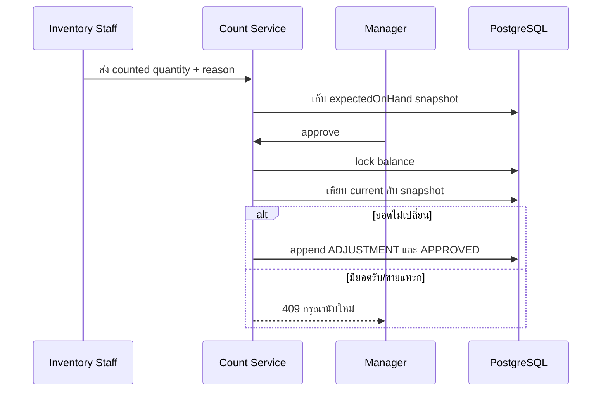

# บทเรียน 05: Stock Count Approval และ Customer Anonymization

## Stock Count คืออะไร

การตรวจนับแยก “หลักฐานที่พนักงานเห็น” ออกจาก “คำสั่งเปลี่ยนยอด” Inventory Staff ส่งยอดนับและเหตุผลในสถานะ `SUBMITTED` ระบบ snapshot `expectedOnHand` ไว้ Manager จึงอนุมัติหรือปฏิเสธภายหลังได้

การตรวจ stale snapshot ป้องกัน adjustment ทับ movement ที่เกิดหลังนับ ส่วน adjustment เก็บผู้อนุมัติและเหตุผลใน ledger ไม่แก้ประวัติเก่า

## Customer Anonymization คืออะไร

เมื่อลูกค้าขอลบข้อมูล ระบบไม่ลบ customer row เพราะบิลในอนาคตต้องรักษาความสัมพันธ์และยอดขายย้อนหลัง แต่ล้างชื่อจริง เบอร์โทร หมายเหตุ และ consent แล้วแทนชื่อด้วยรหัสที่ระบุตัวบุคคลไม่ได้

นี่เป็นแนวทางลดข้อมูลส่วนบุคคล ไม่ใช่คำรับรองว่าระบบผ่าน PDPA เพราะการปฏิบัติตามกฎหมายยังขึ้นกับวัตถุประสงค์ ระยะเวลาเก็บ กระบวนการองค์กร และสิทธิของเจ้าของข้อมูล

## จุดที่ควรระวัง

- ผู้บันทึก Count กับผู้อนุมัติถูก audit แยกกัน
- เฉพาะ OWNER/MANAGER อนุมัติ Adjustment; Inventory Staff ส่งยอดนับได้
- consent ต้องเก็บเวลาที่เปลี่ยน ไม่ใช่มีเพียง boolean
- เบอร์โทรถูก normalize ก่อนตรวจซ้ำ แต่ยังเก็บรูปแบบที่ผู้ใช้กรอกเพื่อแสดงผล
- Purchase history จะอ่านจาก immutable completed sales ใน branch POS

## ลองอธิบายกลับ

1. ทำไม Count ต้องเก็บ `expectedOnHand`?
2. ทำไม anonymize เหมาะกว่าลบ row เมื่อลูกค้ามีประวัติซื้อ?
