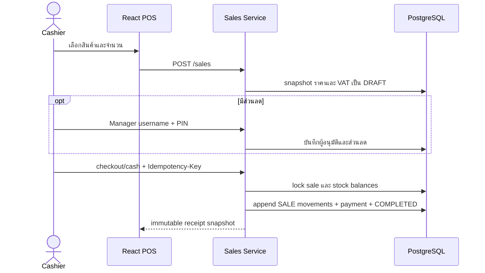

# บทเรียน 06: POS เงินสด, VAT Snapshot และการอนุมัติส่วนลด

## POS ในระบบนี้คืออะไร

POS ไม่ใช่เพียงหน้าคิดเงิน แต่เป็น transaction ที่เชื่อมราคา ส่วนลด ภาษี สต็อก ต้นทุน การชำระเงิน และ audit เข้าด้วยกัน เมื่อบิล `COMPLETED` แล้วจึงถือว่าเป็นหลักฐานทางธุรกิจและห้ามแก้ย้อนหลัง



## Transaction boundary ทำงานอย่างไร

`SalesService.checkoutCash` เป็น transaction boundary ของการขายเงินสด ลำดับสำคัญคือ:

1. lock บิลและตรวจ `Idempotency-Key`
2. lock ยอดสินค้าตาม product ID ที่เรียงลำดับแล้ว เพื่อลดโอกาส deadlock
3. ตรวจ `available` และห้ามยอดติดลบ
4. snapshot ต้นทุนเฉลี่ยสี่ตำแหน่งลง sale item
5. เพิ่ม movement ชนิด `SALE`
6. บันทึก cash payment, เลขใบเสร็จ และสถานะ `COMPLETED`

ถ้าขั้นใดล้มเหลว transaction จะ rollback ทั้งหมด จึงไม่มีกรณีตัดสต็อกแล้วแต่ไม่มี payment หรือได้ใบเสร็จโดยไม่ตัดสต็อก

## ทำไมต้องใช้ Idempotency Key

ผู้ใช้กดซ้ำหรือ network retry ได้ หาก checkout เดิมถูกส่งซ้ำ ระบบค้นหาผลลัพธ์ด้วย key เดิมและคืนบิลเดิมแทนการตัดสต็อกซ้ำ key ต้องสร้างต่อหนึ่งความตั้งใจชำระเงิน ไม่ควรใช้ key เดียวกับคนละบิล

## VAT แบบราคารวมภาษี

ราคาที่หน้าร้านเป็นราคาสุทธิรวม VAT สูตรส่วนภาษีคือ:

```text
vatAmount = total - (total / (1 + vatRate / 100))
```

ตัวอย่างยอดสุทธิ 100 บาทที่ VAT 7% มีฐานก่อนภาษี 93.46 และ VAT 6.54 บาท ระบบใช้ `BigDecimal` และ round เป็นสองตำแหน่งตามจุดที่กำหนด ไม่ใช้ `double` เพราะเงินต้องคำนวณแบบ decimal ที่แน่นอน

ค่า `vatEnabled` และ `vatRate` ถูก snapshot ตอนสร้างบิล การเปลี่ยนค่าร้านภายหลังจึงไม่เปลี่ยนประวัติบิลเก่า

## Manager PIN และ Audit

แคชเชียร์เปิด dialog ขอส่วนลดได้ แต่ต้องใช้ username และ PIN ของ OWNER/MANAGER ระบบเก็บ `discountApprovedBy` เป็น user ID และจำกัดการลอง PIN ผิด 5 ครั้งก่อนพัก 15 นาที PIN ถูก hash ด้วย BCrypt เช่นเดียวกับรหัสผ่านและไม่ส่งกลับ API

## ใบเสร็จและข้อจำกัด

Browser Print รองรับ layout 80mm และใช้หน้าต่างพิมพ์ของ browser เพื่อเลือก A4 ได้ เอกสารระบุชัดว่า “ไม่ใช่ใบกำกับภาษี” เพราะ Phase 1 ยังไม่มีเลขประจำตัวผู้เสียภาษี สาขา running number ตามข้อกำหนดภาษี หรือ e-Tax workflow

## จุดที่ควรระวัง

- frontend แสดงยอดประมาณการได้ แต่ backend ต้องเป็นผู้ยืนยันราคา ส่วนลด และ VAT
- row lock ป้องกันการขายสินค้าชิ้นสุดท้ายพร้อมกัน โดยมี concurrency test ยืนยันว่าสำเร็จเพียงหนึ่งบิล
- trigger ป้องกัน update/delete บิลและรายการของบิล `COMPLETED` แม้มี SQL อื่นข้าม application service
- rate limit ใน Phase 1 เก็บใน memory ของ application เดียว หาก scale หลาย instance ต้องย้ายไป shared store

## ลองอธิบายกลับ

1. ทำไม checkout ต้อง lock stock balance และห้ามเชื่อยอดจาก frontend?
2. ถ้าผู้ใช้กดปุ่มชำระสองครั้ง `Idempotency-Key` ช่วยอย่างไร?
3. ทำไม VAT ของบิลเก่าต้องเป็น snapshot?
