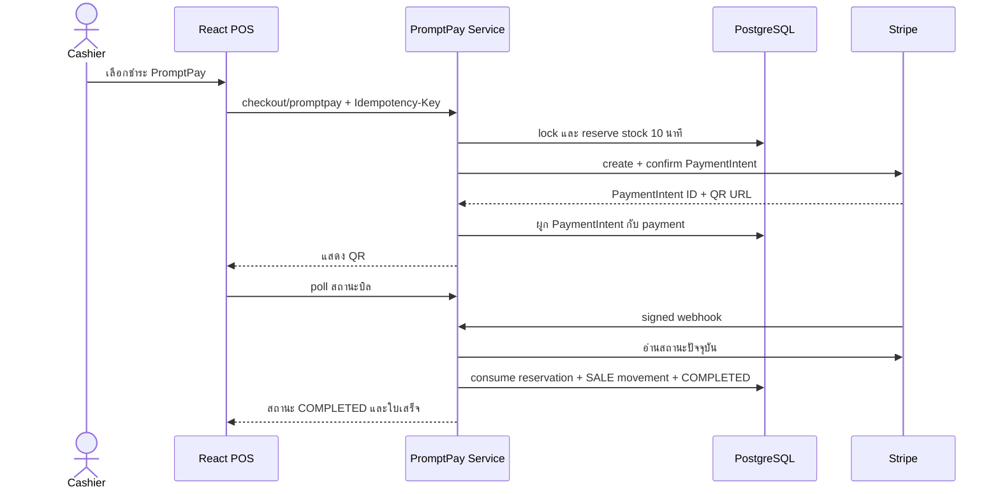

# บทเรียน 07: Stripe PromptPay, Stock Reservation และ Webhook

## ฟีเจอร์นี้คืออะไร

PromptPay ต่างจากเงินสดตรงที่การสร้าง QR ยังไม่ใช่หลักฐานว่าได้เงินแล้ว ระบบจึงต้องเก็บบิลเป็น `AWAITING_PAYMENT` จองสินค้าไว้ชั่วคราว และรอ Stripe webhook ที่ตรวจลายเซ็นแล้วเป็นผู้ยืนยันผลสุดท้าย



## Data flow และ transaction boundary

ระบบแบ่งงานเป็น transaction สั้น ๆ เพราะไม่ควรถือ database lock ระหว่างรอ network จาก Stripe:

1. `PromptPayTransactions.reserve` lock บิลและ balance, เพิ่ม `reserved`, สร้าง payment/reservation แล้ว commit
2. `StripePromptPayGateway.create` เรียก Stripe นอก transaction โดยใช้ idempotency key เดิม
3. `PromptPayTransactions.attach` บันทึก PaymentIntent ID และ QR
4. webhook ตรวจ signature แล้ว `PromptPayService` อ่านสถานะล่าสุดจาก Stripe
5. `PromptPayTransactions.process` lock ข้อมูลทั้งหมดและตัดสินใจ consume หรือ release ใน transaction เดียว

`onHand` คือของจริงที่มีอยู่, `reserved` คือของที่กันไว้ให้ payment ที่ยังไม่จบ และ `available = onHand - reserved` คือจำนวนที่บิลอื่นยังขายได้

## ทำไม webhook เป็นผู้ยืนยันผลสุดท้าย

หน้า browser ปิดได้, network หลุดได้ และผู้ใช้อาจแสดงภาพ QR โดยยังไม่จ่าย ดังนั้น frontend ทำหน้าที่แสดง QR และ poll สถานะเท่านั้น ไม่สามารถสั่งให้บิล `COMPLETED` ได้

`StripeWebhookVerifier` ใช้ raw request payload, header `Stripe-Signature` และ webhook secret ตรวจ HMAC ก่อนรับ event endpoint นี้ไม่ต้องมี session/CSRF เพราะผู้เรียกคือ Stripe แต่ยังถูกป้องกันด้วยลายเซ็นเฉพาะ webhook

## Event ซ้ำและ event สลับลำดับ

- event ID เป็น primary key ใน `stripe_events`; event เดิมจึงตัดสต็อกซ้ำไม่ได้
- ระบบไม่เชื่อชื่อ event อย่างเดียว เพราะ Stripe ไม่รับประกันลำดับการส่ง ระบบอ่านสถานะ PaymentIntent ปัจจุบันก่อนตัดสินใจ
- ถ้า webhook มาเร็วกว่า transaction ที่ผูก PaymentIntent ระบบ rollback event เพื่อให้ Stripe retry ภายหลัง

นี่คือแนวคิด idempotency สองชั้น: request จาก POS ใช้ `Idempotency-Key` และ webhook ใช้ Stripe event ID

## Reservation หมดอายุทำงานอย่างไร

`ReservationExpiryJob` ตรวจทุก 30 วินาที เมื่อเกิน 10 นาทีจะ:

1. lock reservation และคืนจำนวน `reserved`
2. เปลี่ยน payment เป็น `CANCELLED` และบิลเป็น `EXPIRED`
3. commit ฐานข้อมูลก่อนพยายามยกเลิก PaymentIntent ที่ Stripe

หากยกเลิก Stripe ไม่สำเร็จ ระบบบันทึก error แต่ไม่เอาสต็อกไปล็อกค้าง ถ้ามี late success ระบบต้อง reacquire stock ด้วย lock ก่อน ห้ามสร้าง stock ติดลบ ถ้าของไม่พอ webhook จะล้มเหลวเพื่อเข้าสู่การตรวจสอบแทนการซ่อนความผิดปกติ

## Source-to-effect ที่ควรเปิดอ่าน

```text
POST /api/v1/sales/{id}/checkout/promptpay
  -> SalesController
  -> PromptPayService
  -> PromptPayTransactions.reserve
  -> StripePromptPayGateway.create
  -> PromptPayTransactions.attach
  -> PostgreSQL + Stripe Test Mode

POST /api/v1/payments/stripe/webhook
  -> StripeWebhookController
  -> StripeWebhookVerifier
  -> PromptPayService.processWebhook
  -> PromptPayTransactions.process
  -> inventory balance + stock movement + payment + sale
```

## จุดที่ควรระวัง

- ใช้เฉพาะ `sk_test_...` ใน Phase 1 และห้าม commit secret
- webhook secret ของ Stripe CLI กับ Dashboard endpoint เป็นคนละค่า ต้องใช้ให้ตรงแหล่ง
- QR URL เป็นข้อมูลชั่วคราวและต้องแสดงเวลาหมดอายุ
- production ควรมีหน้าสำหรับ reconciliation payment ที่ผิดปกติและ metric แจ้งเตือน webhook failure

## ลองอธิบายกลับ

1. ทำไมการสร้าง QR แล้วตัด `onHand` ทันทีจึงไม่ถูกต้อง?
2. ทำไมจึงไม่เรียก Stripe ขณะถือ row lock?
3. event ID และ Idempotency-Key ป้องกันปัญหาคนละชั้นอย่างไร?
